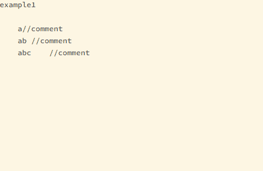
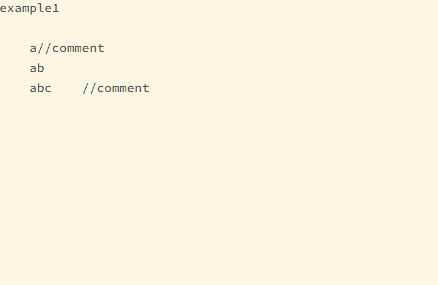

# example1
    a//comment                                          a   //comment
    ab //comment         ->(command:comment format)     ab  //comment
    abc    //comment                                    abc //comment

# example2
    a//comment                                          a   //comment
    ab                   ->(command:comment format)     ab
    abc    //comment                                    abc //comment

# example3
    a//comment                                          a   //comment
    ab                   ->(command:comment format(A))  ab  //
    abc    //comment                                    abc //comment
