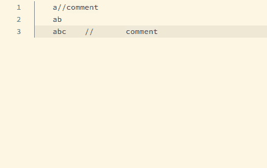

# **NOTE1: Make sure your code is in version control. So you can restore the code when you get the error result.**
# **NOTE2: Only partial code has been tested. Do not use it for whole file. Otherwise, you may encounter the following error.**


# 1


# 2


# 3 (A)


# 4


# 5



TEST CASE:
### 1
```
    a//comment
    ab //comment
    abc    //comment
```
### 2,3
```
    a//comment
    ab
    abc    //comment
```
### 4,5
```
    a//comment
    ab
    abc    //       comment
```
